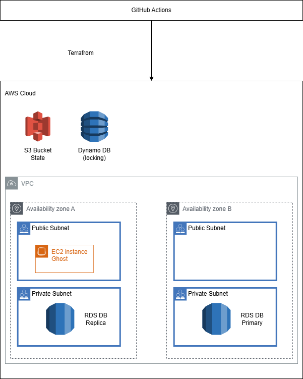

# Ghost CMS on AWS

## Overview

This project deploys a production-ready Ghost CMS blogging platform on AWS infrastructure using Terraform and GitHub Actions. It implements a robust remote state management solution to ensure consistent deployments across CI/CD pipelines.



## Architecture

The infrastructure consists of:

- **Ghost CMS** running in Docker on an EC2 instance
- **MySQL RDS** database for content storage
- **VPC** with public and private subnets across two availability zones
- **Security Groups** for controlled access
- **Remote Terraform State** stored in S3 with DynamoDB locking

## NOTEE:
I should save the ec2 created keys.

## Remote State Management

This project uses AWS S3 for remote state storage with DynamoDB for state locking, providing:

- **Consistency**: Ensures all deployments use the same state information
- **Concurrency Control**: Prevents conflicts when multiple users or processes run Terraform
- **Versioning**: Maintains history of all state changes
- **Security**: Encrypts sensitive state data at rest

## Prerequisites

- AWS account with appropriate permissions
- GitHub repository with Actions enabled
- AWS credentials stored as GitHub secrets
  - **Setting up AWS credentials**:
    1. Create an IAM user in AWS Console (Services > IAM > Users > Add user)
    2. Attach the following policies or create a custom policy with these permissions:
       - `AmazonS3FullAccess` (for Terraform state bucket)
       - `AmazonDynamoDBFullAccess` (for state locking table)
       - `AmazonEC2FullAccess` (for EC2 instances)
       - `AmazonRDSFullAccess` (for database)
       - `AmazonVPCFullAccess` (for networking)
    4. For production, consider creating a custom policy with more restricted permissions:
       ```json
       {
         "Version": "2012-10-17",
         "Statement": [
           {
             "Effect": "Allow",
             "Action": [
               "s3:ListBucket",
               "s3:GetObject",
               "s3:PutObject",
               "s3:DeleteObject"
             ],
             "Resource": [
               "arn:aws:s3:::ghost-terraform-state-bucket-devsec",
               "arn:aws:s3:::ghost-terraform-state-bucket-devsec/*"
             ]
           },
           {
             "Effect": "Allow",
             "Action": [
               "dynamodb:GetItem",
               "dynamodb:PutItem",
               "dynamodb:DeleteItem"
             ],
             "Resource": "arn:aws:dynamodb:us-east-1:*:table/ghost-terraform-locks"
           },
           {
             "Effect": "Allow",
             "Action": [
               "ec2:*", "rds:*", "s3:*", "dynamodb:*",
               "iam:PassRole", "iam:GetRole", "iam:CreateRole",
               "iam:DeleteRole"
             ],
             "Resource": "*"
           }
         ]
       }
       ```
    5. After creating the user, save the Access Key ID and Secret Access Key

  - **Adding secrets to GitHub**:
    1. Go to your GitHub repository
    2. Navigate to Settings > Secrets and variables > Actions
    3. Click "New repository secret"
    4. Add the following secrets:
       - Name: `AWS_ACCESS_KEY_ID` - Value: Your IAM user access key
       - Name: `AWS_SECRET_ACCESS_KEY` - Value: Your IAM user secret key
       - Name: `SLACK_WEBHOOK` (optional) - Value: Your Slack webhook URL for notifications (https://api.slack.com/messaging/webhooks)

## Deployment

The project uses GitHub Actions for automated deployment:

1. Push changes to the `main` branch
2. GitHub Actions workflow automatically:
   - Sets up the remote state infrastructure (S3 bucket and DynamoDB table)
   - Initializes Terraform with the remote backend
   - Applies the infrastructure changes
   - Runs security scanning with Semgrep

## Security Features

- Encrypted state storage
- Security scanning with Semgrep
- Restricted SSH access
- Database in private subnet

## Outputs

After deployment, the following outputs are available:

- Ghost CMS URL
- EC2 instance public IP
- RDS database endpoint

## Troubleshooting

### Common Issues

**"DB instance already exists" error**

This error occurred with local state because each workflow run started with a fresh state file. The remote state solution fixes this by maintaining consistent state across all runs.

```
 aws rds wait db-instance-deleted --db-instance-identifier ghostdb --region us-east-1
```